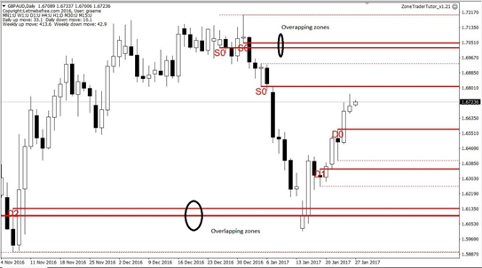
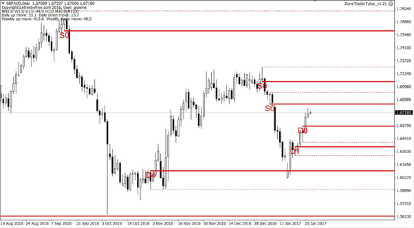
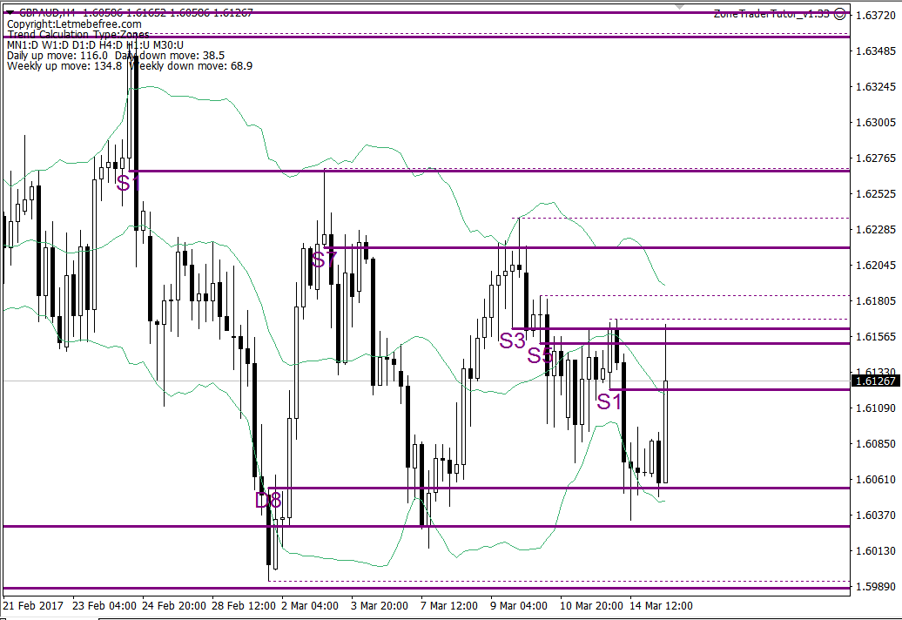
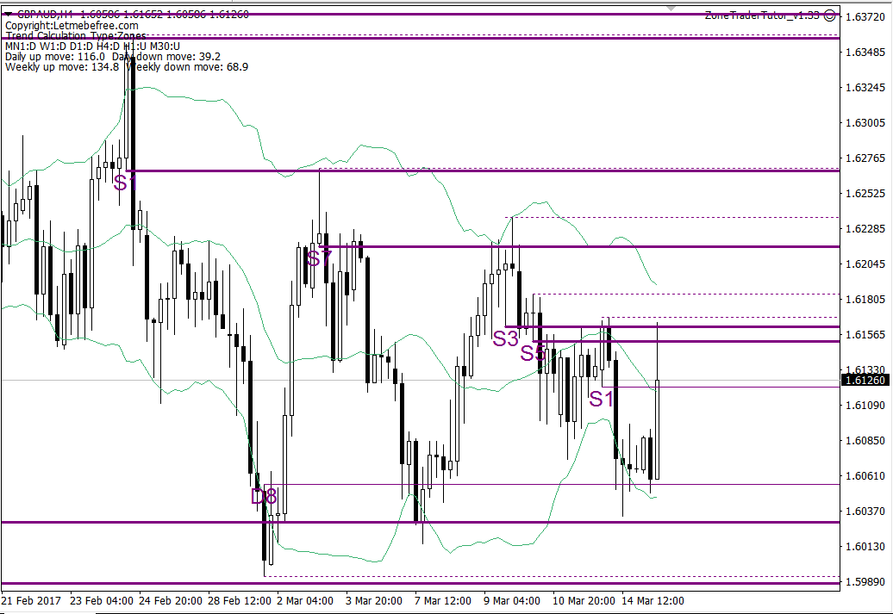
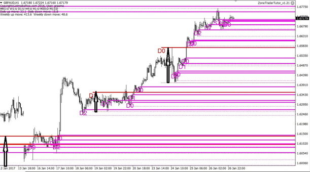
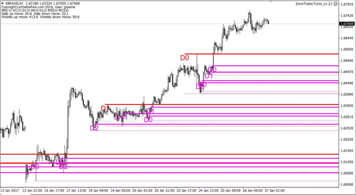

# Overlapping Zones

## **Exclude the inner of any overlapping zones:**

Looking at a single time frame, there will be instances where two or more of the zones overlap with each other. In this scenario, the zones further away from price will always have a higher probability of rejecting price. Therefore, we may look to ignore any of the inner zones when it comes to trading retests. This can be achieved by setting this parameter to true.

The following example shows two charts, the first with the value set to false, the second with it true.

Once set to true, we see the inner of the overlapping zones highlighted in the first chart disappear as they become inactive

## Only include zones with entries inside another zone:

This parameter can be used to exclude any zones that have their entry level sitting inside another zone from the same time frame. Considering supply zones for now, the principle behind this is that as price approaches two overlapping zones, there are insufficient residual sell orders at the first zones entry level to turn price. However, as price passes through, many of the buy orders creating the upward momentum are absorbed. By time price reaches the next zones entry level, there are very few buyers remaining and residual sell orders will force price back down due to the supply/demand imbalance.

The following diagrams illustrate what happens before and after this parameter is switched from false to true.

Before the change, we see the zones below. Pay particular attention to the zones immediately above and below price.

Once the parameter is set to true, the following is seen. Here we see the two zones closest to price \(one above, one below\) becoming inactive. This is because in both instances, the entry level is not inside another zone from the same time frame.

## **Only use zones that fall inside a HTF zone:**

The EA can compare zones across different time frames to see when a zone on one time frame falls inside a zone on a higher time frame. This increases the probability that price will reverse at the smaller time frame zone.

The principle is that traders may use a timeframe such as D1 to set their approximate entry point, but use a smaller time frame to minimise their stop size and improve the potential reward relative to the risk taken on.

The parameter **HTF of zone for which entry must be inside** determines the higher time frame zones to consider. For example, if this is set to CHART\_D1, any supply zones from smaller time frames will be inactive if their entry level falls inside a daily supply zone. A similar scenario applies for demand zones.

The following charts show daily and H1 zones before and after applying the setting.

In the first chart, we see many different H1 zones \(magenta\) with just a few daily zones \(red, with black arrows at their origin\).

In the next chart, we show how H1 zones that do not fall inside a daily zone become inactive and disappear. Only H1 zones that fall inside a daily zone remain active.

